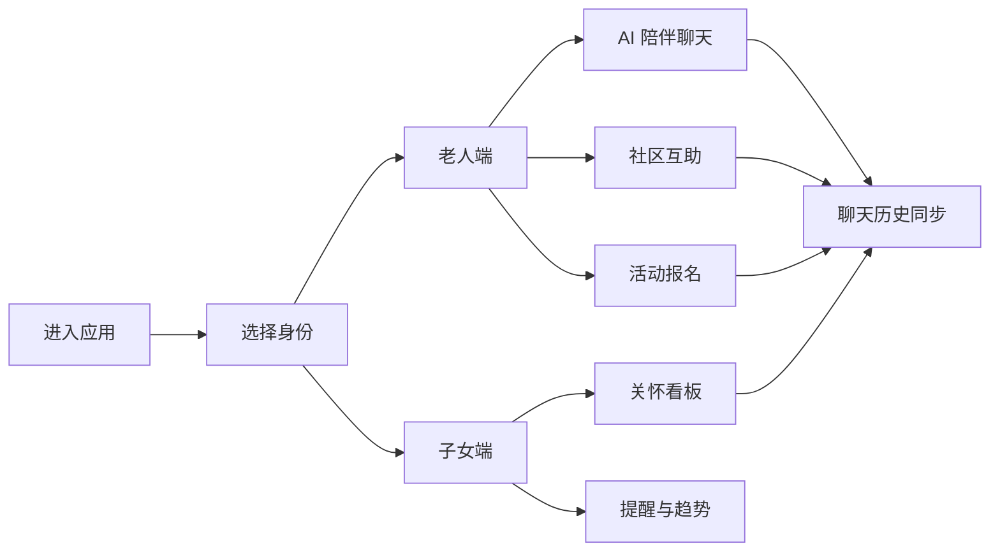
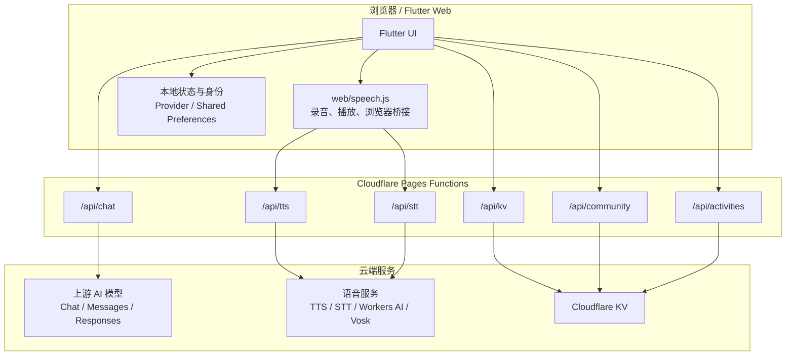
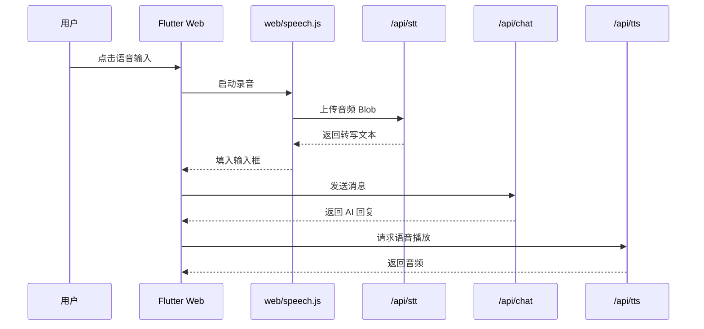

<p align="center">
  
</p>

<h1 align="center">银聆 Silver Companion AI</h1>

<p align="center">
  面向养老陪伴、家庭关怀与社区互助的 Flutter Web + Cloudflare 演示项目
</p>

<p align="center">
  
  
  
  
</p>

---

## 项目概览

银聆是一个围绕“老人日常陪伴”和“子女远程关怀”设计的 AI 产品原型。它把老人端服务大厅、AI 陪伴聊天、语音输入与播放、社区互助、活动报名、子女关怀看板整合到一个完整演示闭环中。

项目不是单纯的静态页面，而是一个带轻量后端的 Flutter Web 应用：前端负责交互体验，Cloudflare Pages Functions 负责代理 AI、TTS、STT 和 KV 数据读写，从而避免把服务密钥暴露给浏览器。

| 维度 | 说明 |
| --- | --- |
| 产品定位 | 适老化 AI 陪伴与家庭关怀演示平台 |
| 主要用户 | 老人、子女、社区志愿者、演示评审 |
| 前端形态 | Flutter Web 单页应用 |
| 后端形态 | Cloudflare Pages Functions 轻量 API |
| 数据持久化 | Cloudflare KV |
| AI 能力 | 对话、文本转语音、语音转文字 |
| 适用场景 | 课程/比赛演示、产品原型验证、部署方案展示 |

## 目录

- [功能亮点](#功能亮点)
- [用户角色与核心流程](#用户角色与核心流程)
- [系统架构](#系统架构)
- [技术栈](#技术栈)
- [项目结构](#项目结构)
- [本地开发](#本地开发)
- [部署到 Cloudflare Pages](#部署到-cloudflare-pages)
- [环境变量](#环境变量)
- [测试与质量](#测试与质量)
- [文档索引](#文档索引)

## 功能亮点

| 功能模块 | 面向对象 | 已实现能力 | 关键文件 |
| --- | --- | --- | --- |
| AI 陪伴聊天 | 老人端 | 中文对话、关怀式回复、诈骗风险提示、发布辅助 | `lib/features/chat/` |
| 语音输入 | 老人端 | 浏览器录音、上传 `/api/stt`、转写为文本 | `web/speech.js`、`functions/api/stt.js` |
| 语音播放 | 老人端 | 调用 `/api/tts` 获取语音并播放 | `lib/services/tts_client.dart`、`functions/api/tts.js` |
| 服务大厅 | 老人端 | 聊天、社区、活动等入口整合 | `lib/features/elderly/` |
| 子女看板 | 子女端 | 家人状态、提醒时间线、趋势图表 | `lib/features/child/` |
| 社区互助 | 双端/社区 | 发布求助、响应求助、状态同步 | `lib/features/community/`、`functions/api/community.js` |
| 活动报名 | 老人端 | 发布活动、报名活动、参与状态 | `functions/api/activities.js` |
| 云端同步 | 全局 | 聊天历史、设置、社区、活动数据持久化 | `functions/api/kv/[key].js` |

## 用户角色与核心流程

| 角色 | 典型目标 | 在系统中的路径 |
| --- | --- | --- |
| 老人 | 找陪伴、问问题、参与社区活动 | 登录/选择身份 -> 进入老人端 -> 使用 AI 聊天、语音、社区、活动 |
| 子女 | 了解长辈状态，查看提醒与互动趋势 | 登录/选择身份 -> 进入子女端 -> 查看看板、提醒、趋势图 |
| 社区志愿者 | 响应求助、组织活动 | 社区互助 -> 查看帖子 -> 响应或发布活动 |
| 演示者 | 展示完整产品闭环和技术可行性 | 首页 -> 身份选择 -> 功能演示 -> 部署/架构说明 |



## 系统架构



## 语音链路

语音能力分成两个方向：输入时录音转文字，输出时文字转语音。这样可以避免依赖浏览器原生语音识别，同时把不同 STT/TTS 供应商统一藏在服务端代理后面。

| 方向 | 前端动作 | 后端接口 | 上游服务 | 返回结果 |
| --- | --- | --- | --- | --- |
| 语音输入 | 浏览器录音并上传音频 | `/api/stt` | OpenAI 风格 STT、Vosk、Cloudflare Workers AI | 文本 |
| 语音播放 | 发送回复文本 | `/api/tts` | TTS 服务 | 音频 |



## 技术栈

| 层级 | 技术 | 用途 |
| --- | --- | --- |
| 应用框架 | Flutter Web | 构建跨端 UI 和交互 |
| 状态管理 | Provider | 页面状态与服务注入 |
| HTTP 客户端 | `package:http` | 调用 Pages Functions |
| 本地存储 | Shared Preferences | 演示身份与本地设置 |
| 图表 | fl_chart | 子女端趋势图展示 |
| 浏览器桥接 | `web/speech.js` + Dart JS bridge | 语音录制、播放和回调 |
| 后端函数 | Cloudflare Pages Functions | AI/TTS/STT/KV 安全代理 |
| 持久化 | Cloudflare KV | 聊天、设置、社区、活动状态 |
| 测试 | Flutter Test、Node Test | 前端逻辑和 Functions 单元测试 |

## 项目结构

```text
.
├── lib/
│   ├── app.dart
│   ├── routes.dart
│   ├── features/
│   │   ├── auth/          登录与注册演示
│   │   ├── chat/          AI 聊天、提示词、风控规则
│   │   ├── child/         子女关怀看板
│   │   ├── community/     社区互助
│   │   ├── elderly/       老人端首页与活动
│   │   ├── landing/       首页
│   │   ├── role/          身份选择
│   │   └── settings/      设置页
│   ├── services/          AI、TTS、KV、语音桥接等服务
│   ├── theme/             全局主题
│   └── widgets/           通用组件
├── functions/
│   └── api/               Cloudflare Pages Functions
├── web/
│   ├── speech.js          浏览器语音桥接
│   └── assets/branding/   品牌资源
├── test/                  Flutter 与服务测试
└── docs/                  部署、KV、演示脚本和历史方案
```

## 本地开发

### 环境准备

需要先安装 Flutter，并确认当前环境支持 Web 构建。

```bash
flutter config --enable-web
flutter pub get
```

### 启动应用

```bash
flutter run -d chrome
```

### 运行测试

```bash
flutter test
node --test functions/api/stt.test.mjs
```

### 构建发布产物

```bash
flutter build web --release --no-wasm-dry-run
```

构建输出目录：

```text
build/web
```

## 部署到 Cloudflare Pages

这个项目依赖 `functions/` 中的后端接口。只上传 `build/web` 可以打开静态页面，但聊天、语音、KV、社区和活动功能不会完整工作。

| 配置项 | 推荐值 |
| --- | --- |
| 平台 | Cloudflare Pages |
| 项目根目录 | 仓库根目录 |
| 构建命令 | `flutter build web --release --no-wasm-dry-run` |
| 输出目录 | `build/web` |
| 后端接口目录 | `functions/` |
| 必需绑定 | `SILVER_KV` |

推荐流程：

1. 在 Cloudflare Pages 中连接 GitHub 仓库。
2. 选择部署分支，例如 `main`。
3. 配置 Flutter Web 构建命令。
4. 配置环境变量和 KV namespace binding。
5. 部署后检查 `/api/chat`、`/api/tts`、`/api/stt`、`/api/kv` 是否可用。

详细步骤见 [Cloudflare Pages 部署指南](docs/cloudflare-pages-deployment.md)。

## 环境变量

### AI 对话

| 变量 | 必需 | 说明 |
| --- | --- | --- |
| `AI_API_BASE_URL` | 是 | 上游 AI 接口地址，可填基础地址或完整 endpoint |
| `AI_MODEL_NAME` | 是 | 默认模型名 |
| `AI_API_KEY` | 视服务而定 | 上游服务密钥；自建无鉴权中转站可留空 |
| `AI_API_MODE` | 否 | `chat`、`messages`、`responses`、`auto` |
| `AI_AUTH_HEADER` | 否 | 鉴权 header 名，默认 `authorization` |
| `AI_AUTH_SCHEME` | 否 | 鉴权 scheme，默认 `Bearer` |
| `AI_ANTHROPIC_VERSION` | 否 | Anthropic Messages 版本，默认 `2023-06-01` |
| `AI_MAX_TOKENS` | 否 | 部分上游接口需要的最大输出 token 数 |

### TTS 文本转语音

| 变量 | 必需 | 说明 |
| --- | --- | --- |
| `TTS_API_BASE_URL` | 是 | TTS 服务地址 |
| `TTS_API_KEY` | 是 | TTS 服务密钥 |

### STT 语音转文字

| 变量 | 必需 | 说明 |
| --- | --- | --- |
| `STT_PROVIDER` | 否 | `openai`、`vosk`、`cloudflare`，默认 `openai` |
| `STT_API_BASE_URL` | 视模式而定 | OpenAI 风格和 Vosk 模式需要，Cloudflare 模式不需要 |
| `STT_API_KEY` | 视模式而定 | OpenAI 风格通常需要，Cloudflare 和自建 Vosk 可省略 |
| `STT_MODEL_NAME` | 否 | STT 模型名，Cloudflare 默认 `@cf/openai/whisper` |

### Cloudflare KV

| 绑定名 | 必需 | 用途 |
| --- | --- | --- |
| `SILVER_KV` | 是 | 保存聊天历史、设置、社区帖子、活动与报名状态 |

## 数据持久化

| 数据 | 存储位置 | 说明 |
| --- | --- | --- |
| 聊天历史 | Cloudflare KV | 按演示身份隔离 |
| 用户设置 | Cloudflare KV + 本地缓存 | 关怀模式、模型展示等 |
| 社区帖子 | Cloudflare KV | 发布、响应、响应人数 |
| 活动数据 | Cloudflare KV | 发布、报名、参与者 |
| 演示身份 | Shared Preferences | 本地身份选择和会话辅助 |

更多细节见 [KV 存储使用指南](docs/kv-storage-guide.md)。

## 测试与质量

当前测试覆盖重点：

| 测试类型 | 覆盖内容 | 示例 |
| --- | --- | --- |
| Flutter widget/service test | 聊天控制器、页面流、设置、KV 客户端等 | `test/features/chat/chat_controller_test.dart` |
| Node test | Pages Functions 的 STT 代理逻辑 | `functions/api/stt.test.mjs` |
| 设计记录 | 功能设计、实现计划、历史改动背景 | `docs/plans/` |

常用检查命令：

```bash
flutter test
node --test functions/api/stt.test.mjs
flutter build web --release --no-wasm-dry-run
```

## 文档索引

| 文档 | 内容 |
| --- | --- |
| [Cloudflare Pages 部署指南](docs/cloudflare-pages-deployment.md) | Pages 构建、环境变量、KV 绑定、部署验证 |
| [KV 存储使用指南](docs/kv-storage-guide.md) | KV key 设计、读写路径和使用注意事项 |
| [演示脚本](docs/demo-script.md) | 路演或评审展示时的功能讲解顺序 |
| [历史设计与实现记录](docs/plans/) | 各阶段功能设计与实现计划 |

## 项目状态

银聆当前是演示型产品原型，不是生产级医疗、养老或安全系统。若要进入真实业务环境，还需要补充：

| 方向 | 需要补充 |
| --- | --- |
| 合规与隐私 | 数据授权、隐私政策、日志脱敏、访问审计 |
| 安全 | 账号体系、权限模型、API 限流、密钥轮换 |
| 可靠性 | 监控告警、错误追踪、备份恢复 |
| 业务闭环 | 人工客服、紧急联系人、线下服务流程 |
| 可观测性 | 请求日志、性能指标、用户行为分析 |

---

<p align="center">
  <strong>银聆 Silver Companion AI</strong><br />
  让 AI 陪伴、家庭关怀与社区互助形成一个可演示、可部署、可继续扩展的产品闭环。
</p>
